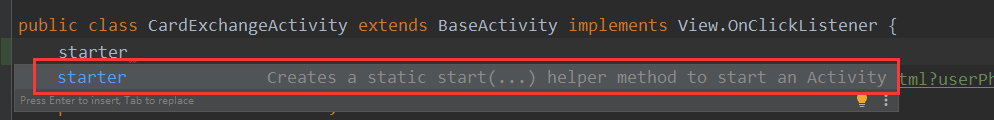
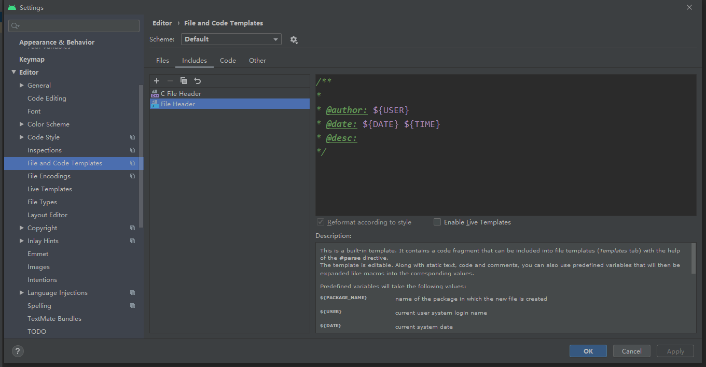

# Android代码规范

## 前言

代码规范是团队高效协作开发的前提，所以说是非常重要的。最近就有想法根据各种规范文档和本人开发经验，做一个我们团队的Android代码规范。说Android开发规范就不得不说Java代码规范，除非使用kotlin进行Android开发。所以本文一共分为两个部分Java代码规范、Android代码规范

## JAVA代码规范

说起java代码规范就不得不提[阿里java开发手册](https://github.com/alibaba/p3c/blob/master/Java%E5%BC%80%E5%8F%91%E6%89%8B%E5%86%8C%EF%BC%88%E5%B5%A9%E5%B1%B1%E7%89%88%EF%BC%89.pdf)，有阿里背书自然很权威，所以日常开发中次规范进行开发。<font color=red>Android studio可直接集成插件：**Alibaba Java Coding Guidelines**</font>，开发过程中会给出规范提示。

这里只列举一些我们平时开发与阿里java开发手册不太一致的部分和容易出错的部分，详情内容请查看[阿里java开发手册](https://github.com/alibaba/p3c/blob/master/Java%E5%BC%80%E5%8F%91%E6%89%8B%E5%86%8C%EF%BC%88%E5%B5%A9%E5%B1%B1%E7%89%88%EF%BC%89.pdf)

### 1 命名规范

1. 【强制】方法名、参数名、成员变量、局部变量都统一使用 lowerCamelCase 风格，必须遵 从驼峰形式。

   <font color=red>Android中成员变量命名与这条规范有出入，多会以m开头，如mLoginButton。我建议Android组件中保持以m开头，而bean类中保持此条规范</font>

2. 【强制】抽象类命名使用 Abstract 或 Base 开头；异常类命名使用 Exception 结尾；测试类 命名以它要测试的类的名称开始，以 Test 结尾。

3. 【强制】POJO 类中布尔类型变量都不要加 is 前缀，否则部分框架解析会引起序列化错误。

4. 【强制】包名统一使用小写，点分隔符之间有且仅有一个自然语义的英语单词。包名统一使 用单数形式，但是类名如果有复数含义，类名可以使用复数形式。

5. 【推荐】在常量与变量的命名时，表示类型的名词放在词尾，以提升辨识度

   <font color=green>正例</font>：startTime / workQueue / nameList / TERMINATED_THREAD_COUNT 

   <font color=orange>反例</font>：startedAt / QueueOfWork / listName / COUNT_TERMINATED_THREAD

6. 【强制】对于 Service 和 DAO 类，基于 SOA 的理念，暴露出来的服务一定是接口，内部的实现类用 Impl 的后缀与接口区别。 

   <font color=green>正例</font>：CacheServiceImpl 实现 CacheService 接口。

### 2 常量定义

1.  【强制】不允许任何魔法值（即未经预先定义的常量）直接出现在代码中。

   <font color=orange>反例</font>：

   ```java
   String key = "Id#taobao_" + tradeId; 
   cache.put(key, value);
   ```

2. 【推荐】不要使用一个常量类维护所有常量，要按常量功能进行归类，分开维护。

   <font color=#FFE333>说明</font>：大而全的常量类，杂乱无章，使用查找功能才能定位到修改的常量，不利于理解和维护。

   <font color=green>正例</font>：缓存相关常量放在类 CacheConsts 下； 系统配置相关常量放在类 ConfigConsts 下。

### 3 代码格式

1. 【推荐】单个方法的总行数不超过 80 行。 

   <font color=#FFE333>说明</font>：除注释之外的方法签名、左右大括号、方法内代码、空行、回车及任何不可见字符的总行数不超过 80 行。 

   <font color=green>正例</font>：代码逻辑分清红花和绿叶，个性和共性，绿叶逻辑单独出来成为额外方法，使主干代码更加清晰； 共性逻辑抽取成为共性方法，便于复用和维护。

### 4 OOP 规约

1. 【强制】所有的覆写方法，必须加@Override 注解。

   <font color=#FFE333>说明</font>：getObject()与 get0bject()的问题。一个是字母的 O，一个是数字的 0，加@Override 可以准确判 断是否覆盖成功。另外，如果在抽象类中对方法签名进行修改，其实现类会马上编译报错。

2. 【强制】接口过时必须加@Deprecated 注解，并清晰地说明采用的新接口或者新服务是什

3. 【强制】不能使用过时的类或方法。

4. 【强制】Object 的 equals 方法容易抛空指针异常，应使用常量或确定有值的对象来调用 equals。 

   <font color=green>正例</font>："test".equals(object); 

   <font color=orange>反例</font>：object.equals("test"); 

   <font color=#FFE333>说明</font>：推荐使用 java.util.Objects#equals（JDK7 引入的工具类）。
   
5. 【强制】构造方法里面禁止加入任何业务逻辑，如果有初始化逻辑，请放在 init 方法中。

### 5 集合处理

1. 【强制】关于 hashCode 和 equals 的处理，遵循如下规则： 

   1） 只要覆写 equals，就必须覆写 hashCode。

   2） 因为 Set 存储的是不重复的对象，依据 hashCode 和 equals 进行判断，所以 Set 存储的对象必须覆 写这两个方法。 

   3） 如果自定义对象作为 Map 的键，那么必须覆写 hashCode 和 equals。 

   <font color=#FFE333>说明</font>：String 已覆写 hashCode 和 equals 方法，所以我们可以愉快地使用 String 对象作为 key 来使用。

2. 【强制】使用集合转数组的方法，必须使用集合的 toArray(T[] array)，传入的是类型完全一致、长度为 0 的空数组。

   <font color=orange>反例</font>：直接使用 toArray 无参方法存在问题，此方法返回值只能是 Object[]类，若强转其它类型数组将出 现 ClassCastException 错误。

   <font color=green>正例</font>：  

   ```java
   List list = new ArrayList<>(2); 
   list.add("guan"); 
   list.add("bao"); 
   String[] array = list.toArray(new String[0]);
   ```

   <font color=#FFE333>说明</font>：使用 toArray 带参方法，数组空间大小的 length： 

   ​	1） 等于 0，动态创建与 size 相同的数组，性能最好。

   ​	2） 大于 0 但小于 size，重新创建大小等于 size 的数组，增加 GC 负担。 

   ​	3） 等于 size，在高并发情况下，数组创建完成之后，size 正在变大的情况下，负面影响与上相同。 

   ​	4） 大于 size，空间浪费，且在 size 处插入 null 值，存在 NPE 隐患。

### 6 控制语句
1. 【强制】在一个 switch 块内，每个 case 要么通过 continue/break/return 等来终止，要么注释说明程序将继续执行到哪一个 case 为止；在一个 switch 块内，都必须包含一个default 语句并且放在最后，即使它什么代码也没有。

    <font color=#FFE333>说明</font>：注意 break 是退出 switch 语句块，而 return 是退出方法体。

2. 【强制】在 if/else/for/while/do 语句中必须使用大括号。

3. 【推荐】表达异常的分支时，少用 if-else 方式，这种方式可以改写成：

   ```java
   if (condition) {
      ...
      return obj;
     }
     // 接着写 else 的业务逻辑代码;
   ```
   <font color=#FFE333>说明</font>：如果非使用 if()...else if()...else...方式表达逻辑，避免后续代码维护困难，<font color=red>【强制】</font>请勿超过 3 层。
   
   <font color=green>正例</font>：超过 3 层的 if-else 的逻辑判断代码可以使用卫语句、策略模式、状态模式等来实现，其中卫语句 即代码逻辑先考虑失败、异常、中断、退出等直接返回的情况，以方法多个出口的方式，解决代码中判断 分支嵌套的问题，这是逆向思维的体现。 
   
   示例如下：
   
   ```java
   public void findBoyfriend(Man man) { 
            if (man.isUgly()) { 
                System.out.println("本姑娘是外貌协会的资深会员"); 
                return; 
            } 
            if (man.isPoor()) { 
                System.out.println("贫贱夫妻百事哀"); 
                return; 
            } 
            if (man.isBadTemper()) { 
                System.out.println("银河有多远，你就给我滚多远"); 
                return; 
            } 
            System.out.println("可以先交往一段时间看看"); 
        }
   ```
   
   

4. 【推荐】除常用方法（如 getXxx/isXxx）等外，不要在条件判断中执行其它复杂的语句，将复杂逻辑判断的结果赋值给一个有意义的布尔变量名，以提高可读性。

   <font color=#FFE333>说明</font>：很多 if 语句内的逻辑表达式相当复杂，与、或、取反混合运算，甚至各种方法纵深调用，理解成 本非常高。如果赋值一个非常好理解的布尔变量名字，则是件令人爽心悦目的事情。

   <font color=green>正例</font>：

   ```java
    // 伪代码如下 
   final boolean existed = (file.open(fileName, "w") != null) && (...) || (...); 
   if (existed) {
   	... 
   } 
   ```

    <font color=orange>反例</font>： 

   ```java
   public final void acquire(long arg) { 
   	if (!tryAcquire(arg) && acquireQueued(addWaiter(Node.EXCLUSIVE), arg)) {
       	selfInterrupt(); 
       } 
   }
   ```

### 7 注释规约

   1. 【强制】类、类属性、类方法的注释必须使用 Javadoc 规范，使用/**内容*/格式，不得使用
   2. 【强制】所有的抽象方法（包括接口中的方法）必须要用 Javadoc 注释、除了返回值、参数、 异常说明外，还必须指出该方法做什么事情，实现什么功能。
   3. 【强制】方法内部单行注释，在被注释语句上方另起一行，使用//注释。方法内部多行注释 使用/* */注释，注意与代码对齐。


## Android代码规范
### 1 包名

包名全部小写，连续的单词只是简单地连接起来，不使用下划线，采用反域名命名规则，全部使用小写字母。一级包名是顶级域名，通常为 `com`、`edu`、`gov`、`net`、`org` 等，二级包名为公司名，三级包名根据应用进行命名，后面就是对包名的划分了，关于包名的划分，推荐采用 PBF（按功能分包 Package By Feature），避免采用 PBL（按层分包 Package By Layer）。关于PBF与PBL优势劣势详细描述，可以参考：[android包命名规范](http://www.ayqy.net/blog/android%E5%8C%85%E5%91%BD%E5%90%8D%E8%A7%84%E8%8C%83/)

假设一个App具有如下功能：

**基础支持功能**

1. 网络请求
2. 图片处理
3. 数据库
4. ……

**业务功能**

1. 新闻相关功能模块
2. 电影相关功能模块
3. 音乐相关功能模块
4. ……

基于上述分包策略，在Android Studio中一个App的层次结构示意图如下：
```java
  java
      |--- com
          |---example
              |--- base
              |    |--- BaseActivity.java
              |    |--- BaseFragment.java
              |    |--- xxx.java
              |
              |--- network
              |    |--- HttpClient.java
              |    |--- xxx.java
              |
              |--- image
              |    |--- ImageManager.java
              |    |--- xxx.java
              |
              |--- db
              |    |--- DbManager.java
              |    |--- xxx.java
              |
              |--- news
              |    |--- NewsActivity.java
              |    |--- NewsFragment.java
              |    |--- xxx.java
              |
              |--- movie
              |    |--- MovieActivity.java
              |    |--- MovieFragment.java
              |    |--- xxx.java
              |
              |--- music
              |    |--- MusicActivity.java
              |    |--- MusicFragment.java
              |    |--- xxx.java
              |
              |--- entity
              |    |--- Movie.java
              |    |--- News.java
              |    |--- xxx.java
              |
              |--- adapter
              |    |--- AbsAdapter.java
              |    |--- MovieAdapter.java
              |
              |--- widget
              |    |--- CircleImageView.java
              |    |--- xxx.java
              |    
              |--- util
                  |--- ToastUtil.java
                  |--- xxx.java
```

### 2 类名

类名都以 `UpperCamelCase` 风格编写。

1. **Activity** 命名一律使用 **模块名+Activity** 的方式。例如，**LoginActivity、SignupActivity**；
2. **Fragment** 命名一律使用 **模块名+Fragment** 的方式；**SkinFragment**
3. **Adapter** 命名一律使用 **模块名+Adapter** 的方式；**SkinAdapter**
4. 自定义**View**：Custom(建议)+功能名+View/ViewGroup(具体的组件名称)。例如：**CustomImageScroller**、**CustomRatingBar**。
5. **Widget** 小组件：**ScanWidget、WeatherWidget**。
6. **Dialog**对话框：**功能名+Dialog**。例如：**LoginDialog、ProgressDialog**

### 3 方法名

方法名都以 `lowerCamelCase` 风格编写。方法名通常是动词或动词短语。

| 方法                        | 说明                                                         |
| --------------------------- | ------------------------------------------------------------ |
| `initXX()`                  | 初始化相关方法，使用 init 为前缀标识，如初始化布局 `initView()` |
| `isXX()`, `checkXX()`       | 方法返回值为 boolean 型的请使用 is/check 为前缀标识          |
| `getXX()`                   | 返回某个值的方法，使用 get 为前缀标识                        |
| `setXX()`                   | 设置某个属性值                                               |
| `handleXX()`, `processXX()` | 对数据进行处理的方法                                         |
| `displayXX()`, `showXX()`   | 弹出提示框和提示信息，使用 display/show 为前缀标识           |
| `updateXX()`                | 更新数据                                                     |
| `saveXX()`, `insertXX()`    | 保存或插入数据                                               |
| `resetXX()`                 | 重置数据                                                     |
| `clearXX()`                 | 清除数据                                                     |
| `removeXX()`, `deleteXX()`  | 移除数据或者视图等，如 `removeView()`                        |
| `drawXX()`                  | 绘制数据或效果相关的，使用 draw 前缀标识                     |

### 4 代码样式规范

#### 4.1 Activities 和 Fragments 的传参

为Activity提供一个**静态工厂方法**，解耦复杂的Activity之间的调用。例如：一个笔记NoteActivity，用于创建笔记和修改笔记

```java
//笔记Id
private static final String EXTRA_KEY_NOTE_ID ="EXTRA_KEY_NOTE_ID" ;
//笔记内容
private static final String EXTRA_KEY_NOTE_CONTENT ="EXTRA_KEY_NOTE_CONTENT" ;
//笔记模式
private static final String EXTRA_KEY_NOTE_MODE ="EXTRA_KEY_NOTE_MODE" ;

//用于创建笔记
public static void startForCreate(Context context, int noteId) {
    start(context, noteId, null, MODE_CREATE);
}
    
//用于编辑笔记
public static void startForEdit(Context context, int noteId, String content) {
    start(context, noteId, content, MODE_UPDATE);
}

public static void start(Context context, int noteId, String content, int mode) {
    Intent starter = new Intent(context, TableShareListSettingActivity.class);
    starter.putExtra(EXTRA_KEY_NOTE_ID,noteId);
    starter.putExtra(EXTRA_KEY_NOTE_CONTENT,content);
    starter.putExtra(EXTRA_KEY_NOTE_CONTENT,mode);
    context.startActivity(starter);
}
```

结合静态方法工厂方法名，代码可阅读行大大提高，最终我们看到的调用NoteActivity将会是很简洁的一段代码：

```java
NoteActivity.startForCreate(this,noteId);
NoteActivity.startForEdit(this,noteId,content);
```

并且android studio提供中提供相应模板，键入<font color=red>starter</font>即可


#### 4.2 增加类注释

使用Android Studio的 File And Code Template：

```java
/**
 * @author: ${USER}
 * @date: ${DATE} ${TIME}
 * @desc: 描述
 */
```



更新者添加描述

```java
 /**
 * @author: ${USER}
 * @date: ${DATE} ${TIME}
 * @desc: 描述
 * @updateUser: 更新者
 * @updateDate: ${DATE} ${TIME}
 * @updateRemark: 更新说明
 */
```

#### 4.3 代码格式化
编辑完 .java、.xml 等文件后一定要 **格式化，格式化，格式化**（如果团队有公共的样式包，那就遵循它，否则统一使用 AS 默认模板即可）；快捷键Ctrl+Alt+L

#### 4.4  删除多余的 import
删除多余的 import，减少警告出现，可利用 AS 的 Optimize Imports（Settings -> Keymap -> Optimize Imports）快捷键；Ctrl+Alt+O

#### 4.5 类成员的顺序
这并没有唯一的正确解决方案，但如果都使用一致的顺序将会提高代码的可读性，推荐使用如下排序：
1. 常量

2. 字段

3. 构造函数

4. 重写函数和回调

5. 公有函数

6. 私有函数

7. 内部类或接口

#### 4.6 函数参数的排序
函数参数的排序在 Android 开发过程中，`Context` 在函数参数中是再常见不过的了，我们最好把 `Context` 作为其第一个参数。正相反，我们把回调接口应该作为其最后一个参数。

```java
// Context always goes first
public User loadUser(Context context, int userId);

// Callbacks always go last
public void loadUserAsync(Context context, int userId, UserCallback callback);
```


### 5 资源Res

#### 5.1 Layout资源命名

| 类型        | 命名规则                      | 示例                                  |
| :---------- | :---------------------------- | ------------------------------------- |
| activity    | activity_模块名。             | R.layout.activity_login               |
| fragment    | fragment_模块名。             | R.layout.fragment_login_layout_header |
| include     | layout\_模块名_功能名。       | R.layout.layout_login_bottom          |
| adapter     | adapter_item\_模块名_功能名。 | R.layout.adapter_item_simple_text     |
| dialog      | dialog\_模块_功能名。         | R.layout.dialog_time_picker           |
| list header | header\_模块_功能。           | R.layout.header_main_top_ad           |
| list footer | footer\_模块_功能。           | R.layout.footer_main_bottom_action    |
| widget      | widget\_模块_功能。           | R.layout.widget_app_clock             |

#### 5.2 控件Id命名

控件Id命名：控件缩写 _模块（module) _功能名(function)

| 控件类型       | ID命名规则            | 示例             |
| -------------- | --------------------- | ---------------- |
| TextView       | tv_module_function    | tv_user_login    |
| EditText       | et_module_function    | et_user_login    |
| ImageView      | iv_module_function    | iv_user_login    |
| Button         | btn_module_function   | btn_user_login   |
| ListView       | lv_module_function    | lv_user_login    |
| GridView       | gv_module_function    | gv_user_login    |
| CheckBox       | check_module_function | check_user_login |
| RadioButton    | radio_module_function | radio_user_login |
| LinearLayout   | ll_module_function    | ll_user_login    |
| RelativeLayout | rl_module_function    | rl_user_login    |
| FrameLayout    | fl_module_function    | fl_user_login    |
| GridLayout     | gl_module_function    | gl_user_login    |

#### 5.3 Drawable资源命名

| Resources Type                                               | 命名规则                     | 示例                                                         |
| ------------------------------------------------------------ | ---------------------------- | ------------------------------------------------------------ |
| icon(图标，多用于展示尺寸较小、图形简单的图标)               | ic\_模块名_功能              | R.drawable.ic_launcher、R.drawable.ic_audio_pause、R.drawable.ic_ab_search |
| image(图片，尺寸相比图标较大，且图形复杂，一般用于前景)      | img\_模块名_功能             | R.drawable.img_splash                                        |
| background(背景，背景多用于View的background属性，9-patch格式的图比较常见，背景上方一般会有其他内容。) | bg\_模块名_页面              | R.drawable.bg_home                                           |
| selector                                                     | selector\_模块名_功能名      | R.drawable.selector_login_button                             |
| shape                                                        | shape\_模块\_功能名_状态后缀 | R.drawable.shape_login_button_normal                         |

常用状态后缀：

- normal：常态（默认态）
- highlight：高亮，常包含pressed、focused、highlight等多种状态
- pressed：按下
- checked：勾选
- selected：选中
- unselected：未选中（selected=false）
- disable：不可用（enable=false）

#### 5.4 Values资源命名

`values/` 资源文件下的文件都以 `s` 结尾，如 `attrs.xml`、`colors.xml`、`dimens.xml`，起作用的不是文件名称，而是 `<resources>` 标签下的各种标签，比如 `<style>` 决定样式，`<color>` 决定颜色，所以，可以把一个大的 `xml` 文件分割成多个小的文件，比如可以有多个 `style` 文件，如 `styles.xml`、`styles_home.xml`、`styles_item_details.xml`、`styles_forms.xml`。

| Resources Type | 命名规则                                         | 示例                                                         |
| -------------- | ------------------------------------------------ | ------------------------------------------------------------ |
| string         | 模块名_(子模块名)\_(页面)\_(组件名称)\_描述      | common_network_error;//全局通用功能模块（common），网络异常的文本提示。 |
| color          | 模块名\_(子模块名)\_(页面)\_(组件名称)\_描述     | account_login_button_background;//账户模块account，登录页面login，按钮的背景。 |
| dimen          | 模块名\_(子模块名)\_(页面)\_(组件名称)\_描述     | account_login_button_width                                   |
| style          | <font color=red>（大驼峰命名法）</font>功能_控件 | 控件命名为：ContentText<br />Application默认的style命名为：AppTheme；<br />用于Activity的style，统一命名为：AppTheme.XXX；<br />用于Dialog的style，统一命名为：Dialog.XXX |

##### 5.4.1 color

color的命名，可以不再加color的表述，例如`color/app_theme`而不是`color/app_theme_color`。

`模块名_(子模块名)_(页面)_(组件名称)_描述`

例如：

```java
R.color.account_login_button_background;//用户账户模块（account），登录页面（login），按钮的背景。
```

有些规范中color命名不推荐按模块\_页面_描述的方式对颜色进行命名。而是用调色板的方式，例如：

```xml
<color name="brand_primary">#FFFFFF</color>
<color name="brand_secondary">#CCCCCC</color>
<color name="brand_negative">#AA000000</color>
```

像这样规范的颜色避免重复定义 ARGB 值，很容易修改或重构，对应用一共使用了多少种颜色也非常清晰。通常一个具有审美价值的 UI 来说，减少使用颜色的种类是非常重要的。

但是我们通常设计出来的效果中包含很多颜色，例如描述文字的颜色可能就有多种、不同模块的背景色、分隔线颜色都不尽相同。如果设计比较统一，也更赞成使用后者。

##### 5.4.2 dimen

与color一样存在两种分歧，一种是`模块名_(子模块名)_(页面)_(组件名称)_描述`，例如：

```java
R.dimen.account_login_button_width;//用户账户模块（account），登录页面（login），按钮的宽度
```

但也有另一种，定义空隙间隔和字体大小的模板

```xml
<resources>

    <!-- font sizes -->
    <dimen name="font_22">22sp</dimen>
    <dimen name="font_18">18sp</dimen>
    <dimen name="font_15">15sp</dimen>
    <dimen name="font_12">12sp</dimen>

    <!-- typical spacing between two views -->
    <dimen name="spacing_40">40dp</dimen>
    <dimen name="spacing_24">24dp</dimen>
    <dimen name="spacing_14">14dp</dimen>
    <dimen name="spacing_10">10dp</dimen>
    <dimen name="spacing_4">4dp</dimen>

    <!-- typical sizes of views -->
    <dimen name="button_height_60">60dp</dimen>
    <dimen name="button_height_40">40dp</dimen>
    <dimen name="button_height_32">32dp</dimen>

</resources>
```

布局时在写 `margins` 和 `paddings` 时，你应该使用 `spacing_xx` 尺寸格式来布局，而不是像对待 `string` 字符串一样直接写值，像这样规范的尺寸很容易修改或重构，会使应用所有用到的尺寸一目了然。我更赞成后者，这样可以避免重复，方便重构，而模块命名的方式，更应该用style来代替。

另外如果适配方案使用smallestwidth，dimen命名更多为`dp_数值`、`sp_数值`的方式。

所以还是根据自己的情况，选择一种适合团队的，形成规范就行。

##### 5.4.3 style、theme

几乎每个项目都需要适当的使用 styles.xml 文件，因为对于一个视图来说，有一个重复的外观是很常见的，将所有的外观细节属性（colors、padding、font）放在 styles.xml 文件中。 在应用中对于大多数文本内容，最起码你应该有一个通用的 styles.xml 文件，一般格式：

例如：

```xml
<style name="ContentText">
    <item name="android:textSize">@dimen/sp_18</item>
    <item name="android:textColor">@color/app_common_content_text</item>
</style>
```

#### <font color=red>注意：组件化开发中，为避免资源冲突，所有资源命名需要加前缀</font>

一般用组件名做为前缀，可以在gradle中进行强制约束。

例如：

```groovy
andorid{
    ...

    buildTypes{
        ...
    }

    resourcePrefix "moudle_prefix"

}
```

### 6 版本统一规范

Android 开发存在着众多版本的不同，比如 `compileSdkVersion`、`minSdkVersion`、`targetSdkVersion` 以及项目中依赖第三方库的版本，不同的 module 及不同的开发人员都有不同的版本，所以需要一个统一版本规范的文件。

添加config.build文件：

```groovy 
ext {
    //android开发版本配置
    android = [
            compileSdkVersion: 29,
            buildToolsVersion: "29.0.2",
            minSdkVersion    : 16,
            targetSdkVersion : 29
    ]
    //依赖第三方配置
    dependencies = [
            'appcompat'                            : "androidx.appcompat:appcompat:1.2.0",
            'material'                             : "com.google.android.material:material:1.2.1",
            'constraintlayout'                     : "androidx.constraintlayout:constraintlayout:2.0.4"
    ]
}
```

在根目录下的build.gradle文件引用：

```groovy
apply from: "config.gradle"
```

在模块目录下build.gradle文件中使用

```groovy
android {
    compileSdkVersion rootProject.ext.android.compileSdkVersion
    buildToolsVersion rootProject.ext.android.buildToolsVersion

    defaultConfig {
        minSdkVersion rootProject.ext.android.minSdkVersion
        targetSdkVersion rootProject.ext.android.targetSdkVersion
    }
    dependencies {
        implementation rootProject.ext.dependencies.appcompat
        implementation rootProject.ext.dependencies.material
        implementation rootProject.ext.dependencies.constraintlayout
    }
}
```

### 7 第三方库规范

总体上尽量使用google推荐的jetpack中的库，以下仅供参考，可能不是最优解，如图片加载库Glide、Picasso、Fresco都是很好用的库，但团队开发中尽量统一使用。持续更新

- 异步操作： RxJava、RxAndroid、RxLife
- 网络请求：Retrofit
- 图片加载：glide
- json：gson
- key-value 组件：mmkv
- 基础框架MVVM：viewmodel、databinding、livedata
- 数据库：Room
- 启动组件：Startup
- 依赖注入：Hilt
- 分页加载：Paging3

## 参考

[Android项目分包(二) Android分包策略推荐](https://blog.csdn.net/q610098308/article/details/78982551)

[android包命名规范](http://www.ayqy.net/blog/android%E5%8C%85%E5%91%BD%E5%90%8D%E8%A7%84%E8%8C%83/)

[Android：你不能忽略的代码命名规范](https://www.jianshu.com/p/b7a644ea0d25)

[Android Code Style Guide](https://www.jianshu.com/p/f5a55dff62f0)

[android开发规范](https://github.com/Blankj/AndroidStandardDevelop)

[Android项目资源文件命名规范参考](https://www.paincker.com/android-resource-naming)