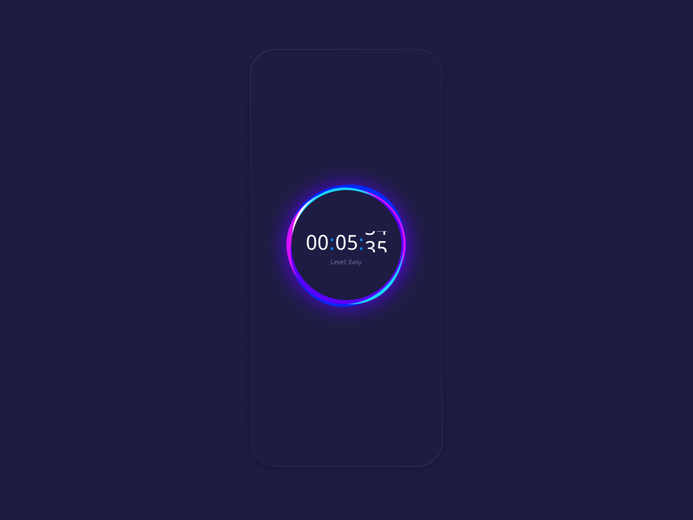
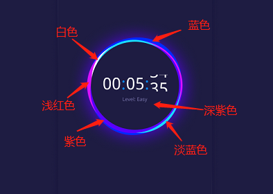
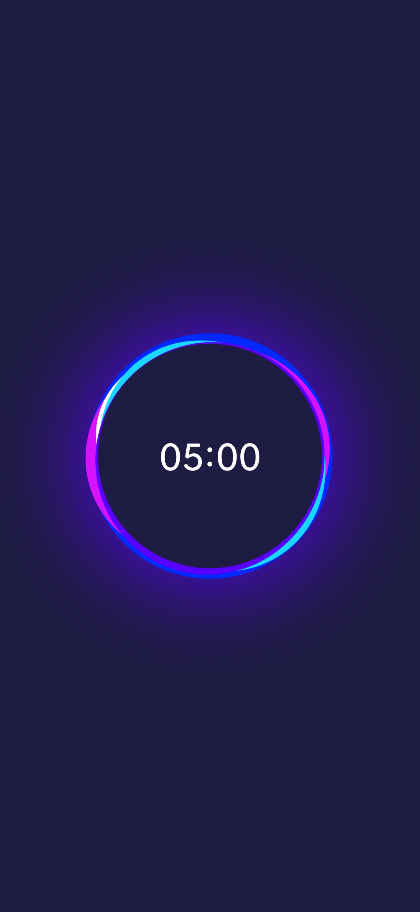

### 背景

最近刷到一张计时器效果图（如图），而个人项目中正需要一个沉浸式的计时器页面，就把这种效果实现。下面就分享一下实现过程。



### 分析

效果图可以分为三层：

- 第一层：最底层的紫色模糊光晕效果
- 第二层：是由蓝色、浅红色、白色、淡蓝色、紫色、深紫色等颜色的圆或椭圆组成
- 第三层：倒计时文字

整体的效果会通过自定义view来实现，所以对自定义view不是很熟悉的小伙伴，可以看一下大神写的这篇文章：

[没见过这么详细的，自定义控件图形探索！](https://mp.weixin.qq.com/s/i9iXNLDATG7_GBBe_IM4qg)

### 第一层

紫色模糊光晕效果。Paint.setMaskFilter(MaskFilter maskfilter)方法，可以用来对图像添加遮罩滤镜效果。MaskFilter类有两个子类BlurMaskFilter和EmbossMaskFilter，前者为模糊遮罩滤镜而后者为浮雕遮罩滤镜。如果对此方法不熟悉，可以看下这篇文章：

[详解Paint的setMaskFilter(MaskFilter maskfilter)](https://www.cnblogs.com/tianzhijiexian/p/4297734.html)

```java
//设置画笔
mLightPaint = new Paint();
// 抗锯齿效果
mLightPaint.setAntiAlias(true);
// 设置颜色
mLightPaint.setColor(0xFF5A00FF);
// 半径
mLightRadius = (int) getResources().getDimension(R.dimen.dp_105);
// 设置模糊遮罩滤镜
mLightPaint.setMaskFilter(new BlurMaskFilter(mLightRadius, BlurMaskFilter.Blur.OUTER));
```

绘制

```java
int cx = getWidth() / 2;
int cy = getHeight() / 2;
canvas.drawCircle(cx, cy, mLightRadius, mLightPaint);
```


### 第二层

蓝色、浅红色、白色、淡蓝色、紫色、深紫色等颜色的圆或椭圆。为方便描述对第二层的图像按颜色进行分类，大体如下：



大体可以看出来蓝色和深紫色是圆形，只是半径和中心点不一样。而其他颜色图像都是椭圆，大小和中心点有所差异。进过多次调整，找到最接近的绘制效果。

计算图形大小及偏移：

```java
//蓝色圆半径及中心点
mBlueRadius = (int) getResources().getDimension(R.dimen.dp_105);
mBlueCx = w / 2;
mBlueCy = h / 2;
//浅红色椭圆大小及偏移
int lightW = (int) getResources().getDimension(R.dimen.dp_210);
int lightH = (int) getResources().getDimension(R.dimen.dp_187);
int paddingX = (w - lightW) / 2;
int paddingY = (h - lightH) / 2;
mLightRedRect = new RectF(paddingX, paddingY, w - paddingX, h - paddingY);
//白色椭圆大小及偏移
lightW = (int) getResources().getDimension(R.dimen.dp_166);
lightH = (int) getResources().getDimension(R.dimen.dp_147);
paddingX = (w - lightW) / 2;
paddingY = (h - lightH) / 2;
mWhiteRect = new RectF(paddingX, paddingY, w - paddingX, h - paddingY);
//浅蓝色椭圆大小及偏移
lightW = (int) getResources().getDimension(R.dimen.dp_206);
lightH = (int) getResources().getDimension(R.dimen.dp_185);
paddingX = (w - lightW) / 2;
paddingY = (h - lightH) / 2;
mLightBlueRect = new RectF(paddingX, paddingY, w - paddingX, h - paddingY);
//紫色椭圆大小及偏移
lightW = (int) getResources().getDimension(R.dimen.dp_195);
lightH = (int) getResources().getDimension(R.dimen.dp_200);
paddingX = (w - lightW) / 2;
paddingY = (h - lightH) / 2;
mPurpleRect = new RectF(paddingX, paddingY, w - paddingX, h - paddingY);
//深紫色圆半径
mDarkPurpleRadius = (int) getResources().getDimension(R.dimen.dp_96);
```

绘制

```java
//绘制
canvas.save();
mRingPaint.setColor(mLightRedColor);
int translateY;
int translateX = (int) getResources().getDimension(R.dimen.dp_2);
canvas.translate(-translateX, -translateX);
canvas.rotate(mLightRedRotate, cx, cy);
canvas.drawOval(mLightRedRect, mRingPaint);
canvas.restore();

canvas.save();
mRingPaint.setColor(mWhiteColor);
translateX = (int) getResources().getDimension(R.dimen.dp_15);
canvas.translate(-translateX, -translateX);
canvas.rotate(mWhiteRotate, cx, cy);
canvas.drawOval(mWhiteRect, mRingPaint);
canvas.restore();

canvas.save();
mRingPaint.setColor(mLightBlueColor);
translateX = (int) getResources().getDimension(R.dimen.dp_2);
canvas.translate(translateX, 0);
canvas.rotate(mLightBlueRotate, cx, cy);
canvas.drawOval(mLightBlueRect, mRingPaint);
canvas.restore();

canvas.save();
mRingPaint.setColor(mPurpleColor);
translateY = (int) getResources().getDimension(R.dimen.dp_2);
canvas.translate(0, translateY);
canvas.rotate(mPurpleRotate, cx, cy);
canvas.drawOval(mPurpleRect, mRingPaint);
canvas.restore();

mRingPaint.setColor(0xFF1E1C42);
canvas.drawCircle(cx, cy, mDarkPurpleRadius, mRingPaint);
```


### 第三层

倒计时文字绘制。倒计时功能使用CountDownTimer实现，每隔一秒刷新。

设置文字大小，计算基线：

```java
//文字画笔参数设置
mTextPaint = new Paint();
mTextSize = getResources().getDimension(R.dimen.sp_32);
mTextPaint.setTextSize(mTextSize);
mTextPaint.setColor(mTextColor);
mTextPaint.setAntiAlias(true);
//计算文字基线
Paint.FontMetrics metrics = mTextPaint.getFontMetrics();
mTextBaseLine = getHeight() / 2f - metrics.descent + (metrics.bottom - metrics.top) / 2;
```

绘制

```java
int minute = (int) (mMillisUntilFinished / 1000 / 60);
int second = (int) (mMillisUntilFinished / 1000 % 60);
String text = (minute < 10 ? ("0" + minute) : minute) + ":" + (second < 10 ? ("0" + second) : second);
mTextPaint.measureText(text);
float textWidth = mTextPaint.measureText(text);
canvas.drawText(text, (getWidth() - textWidth) / 2, mTextBaseLine, mTextPaint);
changeRotate();
```

### 使用

```java
public void setTime(long millis) {
    reset();
    mResetMillis = millis;
    mTotalMillis = millis;
    mMillisUntilFinished = mTotalMillis;
    invalidate();
}

public void start() {
    mCountDownTimer = new CountDownTimer(mTotalMillis, 1000) {
        @Override
        public void onTick(long millisUntilFinished) {
            mMillisUntilFinished = millisUntilFinished;
            invalidate();
        }

        @Override
        public void onFinish() {
            reset();
        }
    };
    mCountDownTimer.start();
}

public void reset() {
    if (mCountDownTimer != null) {
        mCountDownTimer.cancel();
        mCountDownTimer = null;
        mTotalMillis = mResetMillis;
        mMillisUntilFinished = mTotalMillis;
        invalidate();
    }
}
```

### 最终效果



效果和原图效果大体差不多。

源码地址：https://github.com/Jallv/JTodo/blob/master/app/src/main/java/com/jal/todo/widget/FocusCountDownView.java

