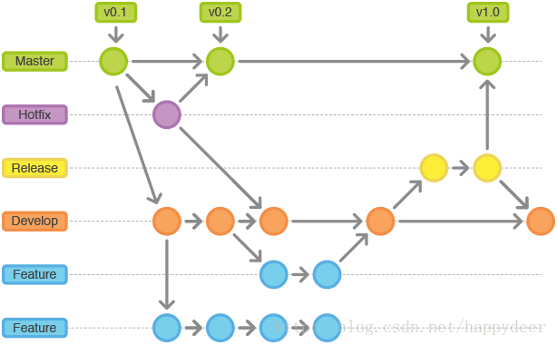

# Android Git Flow 流程

在团队开发中经常会出现以下问题：

1. 一次提交包含多个功能，在开发新功能时如果有问题或需求变更，需要回退代码，就变得很困难，很难做到不影响其他功能；
2. 线上版本出现问题，需要针对指定发布版本进行修复时，很难找到上次发布代码或只能根据提交记录回退代码后进行问题修复；
3. 在功能开发完后进行提测，一部分人员需要对提测版本进行问题修复，另一部分人需要进行新功能开发；
4. 提测过程中你在修复问题或开发新功能，测试人员需要最新版本apk，你必须停下手里的事或完成后切换分支去打包；
5. 开发过程中不同开发拉取大量分支，命名不规范很难知道用途或忘记删除，造成仓库混乱，很难找到有用分支；

针对这些问题我们可以结合git flow代码管理流程和Jenkins打包来解决。

### git flow

git flow不是什么新的代码管理系统，只是基于git代码管理的一种思路。使用两个分支（master、develop）来记录项目开发的历史，而不是使用单一的master分支。在git glow流程中，master只是用于保存已发布版本代码，并根据发布版本打上标签，所有的功能代码不直接提交到master，而是通过其他分支合并(merge)。并不是所有成员都有操作master的权限，只有指定人员可以操作，避免大家误操作。而develop分支才是团队成员开发各种功能的分支。

### 功能开发分支（feature）

每一个新功能的开发都应该各自使用独立的分支。**功能分支命名为：feature/功能描述**。功能分支的父分支应该选择develop（而不是master），为了备份或便于团队之间的合作，这种分支也可以被推送到中央仓库。但当功能开发完成时，改动的代码应该被合并（merge）到develop分支，并且删除对应功能分支。

注意：原则上开发一个新功能就需要从develop拉出一个功能分支，功能开发完成后合并（merge）到develop中，最后删除当前功能分支。再进行新功能开发时同样基于develop拉出一个新功能分支，重复以上流程。但有时候我们功能点很小，如何也采用这个流程，难免有点繁琐。所以针对这些简单功能可基于develop拉单独分支，但还是尽量做到一个功能对应一条提交记录（commit）。一系列小功能开发完成后合并（merge）到develop。

### 提测分支（release）

当前版本功能开发完成，自测后就需要进行提测。如果还是在develop上进行，可能会出现部分人员需要对提测问题进行修复，另一部分人需要开发下一版本的功能，所以就需要基于develop单独拉一个release分支进行提测，**命名为：release/版本名称**。

为了解决前面提到的“提测过程中你在修复问题或开发新功能，测试人员需要打最新版本APK，你必须停下手里的事或完成后切换分支去打包”问题，所以提测过程中bug修复我们不直接在release版本中进行，而是基于当前版本的release分支拉一个fix分支，**命名为：fix/问题描述**，一个bug修复完后合并（merge）到对应release分支，删除当前fix分支。而测试需要新包时，就可以直接在Jenkins中基于对应release分支进行打包（Jenkins部署和Android编译环境搭建后面单独说明）。打包过程可让测试人员自己进行，开发只需要保证release分支上代码准确即可。

### 发布后

发布后需要将release分支代码合并到develop和master，并根据版本在master上打上对应tag，最后删除对应release分支。

### 线上问题修复

如果在发布后出现线上问题，需要紧急修复，可基于master分支拉一个hotfit分支，**命名为：hotfit/问题描述**。一旦问题被修复了，所做的改动应该被合并到master和develop分支（或者用于当前发布的release分支）。在这之后，master上还要使用更新的版本号打好标签。

### 参考

https://www.cnblogs.com/jeffery-zou/p/10280167.html

